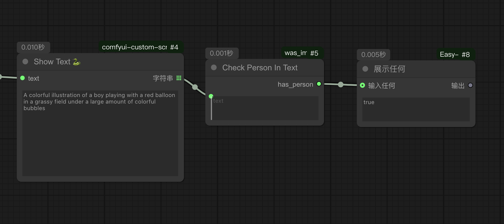
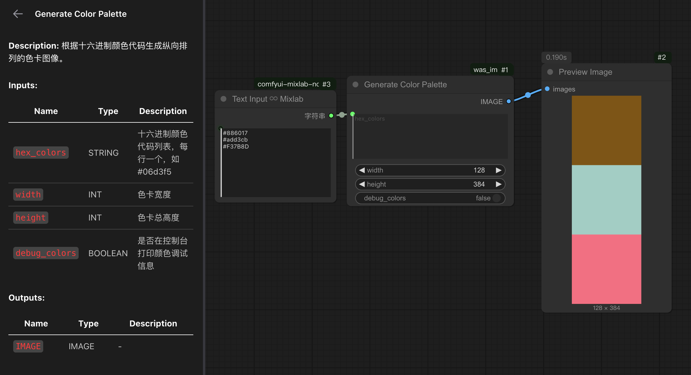
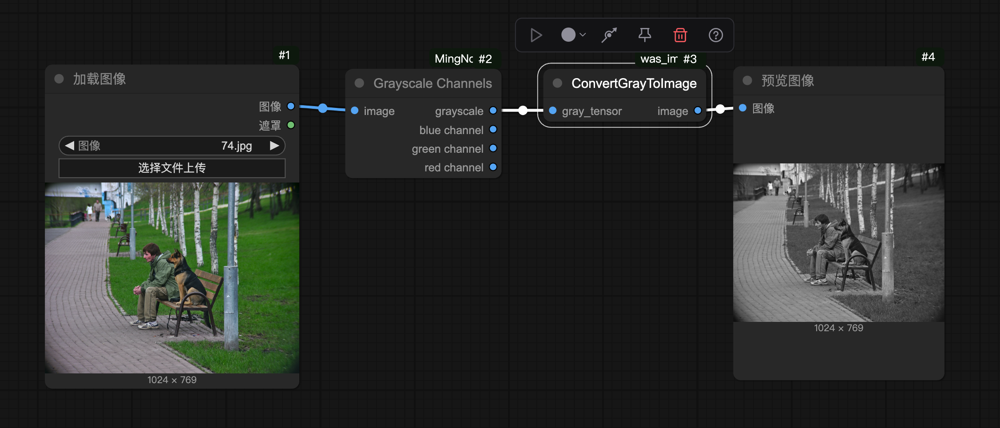
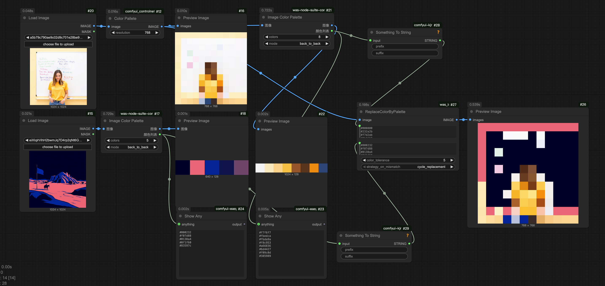

# ComfyUI_was_image

- **[2025-11-10]**

    Added a tool node for checking person in prompts.

    新增提示词中是否包含人物类描述的节点 Check Person In text

    

- **[2025-07-22]**

    Added a tool node for generating a color chart.

    新增一个用于生成色卡的工具节点

    

- **[2025-07-02]**

    Add a new node to convert gray to normal image

    新增一个用于将gray转为普通image的节点

    

- **[2025-07-01]** 

    This is a tool node for recoloring an image. The example workflow uses another node [was-node-suite-comfyui](https://github.com/kongds1999/was-node-suite-comfyui)

    这是一个用于给图像重新上色的工具节点。示例工作流用到另一个节点 [was-node-suite-comfyui](https://github.com/kongds1999/was-node-suite-comfyui)

